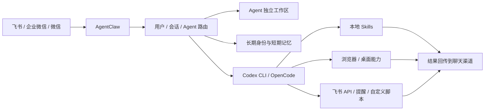
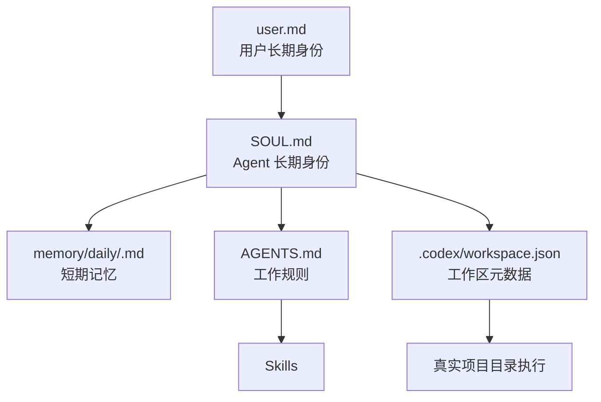

# AgentClaw

[English README](./README.en.md)

[](https://github.com/baibairui/AgentClaw/actions/workflows/ci.yml)
[](./LICENSE)

把 Codex CLI 接到飞书、企业微信或个人微信，让 AI 不再只是一次性聊天窗口，而是一个长期在线、带记忆、带工作区、能执行真实动作的多 Agent 系统。

AgentClaw 不是一个只会回消息的 bot 壳子，而是一个消息入口 + 本地 CLI 执行系统。消息从飞书、企业微信或微信进来后，会被路由到具体 Agent 的独立工作区，再由本地 Codex CLI、Skills、浏览器能力、提醒能力和平台 API 能力继续执行，最后把结果回传到聊天渠道。

## 一眼看懂

如果你只想快速理解这个项目，记住三件事：

- 它把 Codex CLI 从终端里的个人工具，变成团队里长期在线的 Agent 系统
- 它让每个 Agent 都有独立工作区、长期身份、短期记忆和执行边界
- 它不只会回复文本，还能进入真实目录执行任务，调用工具链，持续接着做事

## AgentClaw 和普通聊天机器人有什么不同

| 能力 | AgentClaw | 普通聊天机器人 |
| --- | --- | --- |
| 每个 Agent 独立工作区 | 有 | 通常没有 |
| 每个 Agent 独立长期身份与记忆 | 有 | 常常共用上下文 |
| 在真实项目目录里运行 Codex CLI | 有 | 少见 |
| 本地 Skill / 工具系统 | 有 | 常常只有文本回复 |
| 浏览器 / 桌面真实操作能力 | 可接入 | 通常没有 |
| 飞书 / 企业微信 / 个人微信接入 | 有 | 常常只有单一渠道 |
| 自托管 | 有 | 常常依赖 SaaS |

## 系统长什么样



## 工作区模型

每个 Agent 都有自己的工作目录、规则、身份和短期记忆。不同角色互不污染，这是 AgentClaw 能长期稳定工作的核心。



典型目录结构：

```text
.data/
  users/<user>/
    user.md
    agents/<agent>/
      AGENTS.md
      README.md
      SOUL.md
      memory/daily/
      .codex/workspace.json
```

这套结构把：

- 用户长期身份放在 `user.md`
- Agent 长期身份放在 `SOUL.md`
- 短期上下文放在 `memory/daily/`
- 执行边界落在具体 Agent 工作区

## 你可以拿它做什么

- 在飞书里放一个长期在线的 coding agent
- 给工程、评审、文档、研究分别配不同 Agent
- 让 Agent 在真实仓库里持续读写代码和文档
- 把浏览器操作、提醒、文档写入接进同一条工作链路
- 把团队内部脚本和自动化封装成 Skill 交给 Agent 调用

## 当前支持的渠道

| 渠道 | 状态 | 说明 |
| --- | --- | --- |
| 飞书 | 支持 | 支持长连接模式 |
| 企业微信 | 支持 | 需要公网回调地址 |
| 个人微信 | 支持 | 扫码登录 + 轮询收发 |

## 核心能力

- 多 Agent 路由与会话持久化
- 独立工作区、长期身份、短期记忆
- 本地 Skill 体系
- 浏览器能力链路
- 桌面 GUI 能力链路
- 飞书官方 API 能力
- 提醒与定时任务
- 健康检查与发布脚本
- 面向真实代码仓库的执行环境

## 什么时候适合用它

适合你，如果你想要的是：

- 把 Codex 真正接进团队协作工具
- 让 AI 长期在线，而不是临时问答
- 让不同 Agent 有明确职责和边界
- 让 AI 进入真实工作目录持续工作
- 把工作区、凭证、上下文和自动化能力都掌握在自己手里

不太适合你，如果你只想要：

- 一个简单 FAQ 机器人
- 一个纯托管 SaaS
- 一个不涉及本地 CLI 与工作区执行的轻量 bot

---

# 请让 AI 阅读以下内容并部署

以下内容面向 AI 或运维执行者，目标是在一台机器上把 AgentClaw 跑起来，并验证它已经可用。

## 部署目标

启动一个可运行的 AgentClaw 实例，并至少接通一种消息渠道：

- 飞书
- 企业微信
- 个人微信

默认建议优先使用飞书长连接模式，因为它不依赖公网事件回调地址。

## 运行前提

必须满足：

- Node.js 20+
- npm 10+
- 本机已安装且可执行 `codex`
- 当前机器允许 AgentClaw 访问目标工作目录
- 拥有至少一种消息渠道的应用配置

常见可选依赖：

- `playwright`，用于浏览器自动化
- `xvfb`，用于无桌面的 Linux 服务器
- `pm2` 或 systemd，用于常驻运行
- 反向代理或隧道，用于企业微信 webhook 模式

## 安装依赖

```bash
npm install
```

如果需要浏览器能力：

```bash
npx playwright install chromium
```

如果是无桌面的 Linux 且需要浏览器上下文：

```bash
sudo apt-get update
sudo apt-get install -y xvfb
```

如果本机还没有全局命令，可执行：

```bash
npm link
```

## 飞书接入的重要说明

飞书接入分成两部分。

### 1. 人工完成的平台步骤

以下步骤默认不是 AI 自己自动完成的，而是需要人在飞书开放平台手工完成：

- 创建飞书应用
- 开启机器人能力
- 配置权限
- 配置事件订阅
- 发布应用
- 如有需要，等待管理员审核或审批

这部分不应被理解成“AI 自动完成”。

### 2. AI / CLI 完成的本地接入步骤

拿到应用配置后，AI 或运维可以继续完成：

- 写入 `.env`
- 启动 AgentClaw
- 检查 `/healthz`
- 发送测试消息验证连通性

OpenClaw 官方 Feishu 接入文档：
https://docs.openclaw.ai/channels/feishu

飞书开放平台：
https://open.feishu.cn

## 初始化配置

先复制环境变量模板：

```bash
cp .env.example .env
```

或者使用向导：

```bash
agentclaw setup
```

## 最小可运行配置

### 飞书长连接

```env
PORT=3000

WECOM_ENABLED=false
FEISHU_ENABLED=true
FEISHU_APP_ID=your_app_id
FEISHU_APP_SECRET=your_app_secret
FEISHU_LONG_CONNECTION=true
FEISHU_GROUP_REQUIRE_MENTION=true

CODEX_BIN=codex
CODEX_WORKDIR=/absolute/path/to/agent-root
CODEX_SANDBOX=full-auto
RUNNER_ENABLED=true
CODEX_SEARCH=false
```

说明：

- `FEISHU_APP_ID` / `FEISHU_APP_SECRET` 是最小阻塞项
- 长连接模式不需要公网 webhook 回调地址
- agent 运行默认永久使用隔离的 `bwrap` 工作区，不再提供 `CODEX_WORKDIR_ISOLATION` 切换
- 但仍然需要你先在飞书开放平台完成应用创建、Bot 配置、事件订阅和权限设置

### OpenAI 兼容网关

如果希望旧客户端继续只配置 `base_url + api_key`，可以启用兼容层：

```env
OPENAI_COMPAT_UPSTREAM_BASE_URL=https://api.openai.com/v1
OPENAI_COMPAT_UPSTREAM_API_KEY=sk-upstream
OPENAI_COMPAT_API_KEY=sk-gateway-client
```

客户端侧填写：

- `base_url=http://你的网关地址:3000/v1`
- `api_key=OPENAI_COMPAT_API_KEY`

兼容层会原样代理 `POST /v1/responses`，把旧的 `POST /v1/chat/completions` 转成 Responses API 后再映射回 Chat Completions 格式，并代理 `GET /v1/models`。

### 企业微信

```env
PORT=3000

WECOM_ENABLED=true
WEWORK_CORP_ID=your_corp_id
WEWORK_SECRET=your_secret
WEWORK_AGENT_ID=your_agent_id
WEWORK_TOKEN=your_callback_token
WEWORK_ENCODING_AES_KEY=your_encoding_aes_key

FEISHU_ENABLED=false

CODEX_BIN=codex
CODEX_WORKDIR=/absolute/path/to/agent-root
RUNNER_ENABLED=true
```

### 个人微信

```env
PORT=3000

WECOM_ENABLED=false
FEISHU_ENABLED=false
WEIXIN_ENABLED=true

CODEX_BIN=codex
CODEX_WORKDIR=/absolute/path/to/agent-root
RUNNER_ENABLED=true
```

首次启用个人微信且还没有登录会话时，先执行：

```bash
npm run weixin:login
```

## 启动方式

### 开发模式

适合验证最新源码：

```bash
npm run dev
```

或：

```bash
agentclaw up
```

### 生产模式

适合部署稳定产物：

```bash
npm run build
npm start
```

或：

```bash
agentclaw start
```

## 健康检查

启动后执行：

```bash
curl http://127.0.0.1:3000/healthz
```

成功时应返回类似结果：

```json
{
  "ok": true,
  "channels": {
    "feishu": {
      "enabled": true,
      "mode": "long-connection"
    }
  }
}
```

判断方式：

- `ok=true` 说明服务已启动
- 飞书启用时，`mode=long-connection` 表示长连接模式已生效
- 如果渠道已启用但消息仍不通，优先检查平台侧权限和事件订阅

## 推荐验收顺序

### 飞书

1. 执行 `agentclaw doctor`
2. 启动服务
3. 检查 `/healthz`
4. 在飞书私聊机器人发送一条消息
5. 在飞书群聊中 `@` 机器人发送一条消息

### 企业微信

1. 确认公网回调地址可访问
2. 执行 `agentclaw doctor`
3. 启动服务
4. 检查 `/healthz`
5. 在企业微信中给应用发消息并观察回包

### 个人微信

1. 执行 `npm run weixin:login`
2. 完成扫码登录
3. 启动服务
4. 发送消息验证是否能收到回复

## 常用命令

```bash
npm run dev
npm run build
npm start
npm run weixin:login
npm run config:check
npm run publish:workspace
```

## 关键运行逻辑

部署者需要理解以下几点：

- `CODEX_WORKDIR` 指向 Agent 工作区根目录
- 每个 Agent 在独立工作区中运行
- 长期身份和短期记忆不应混放
- 浏览器、桌面、提醒、飞书 API 等能力通过 Skill 接入
- 开发模式跑的是最新源码
- 生产模式跑的是 `dist/` 产物
- 如果修改了 `src/` 但没有重新 build，`start` 不会自动带上最新源码

## 常见问题

### 1. 服务能启动，但消息没有回

优先检查：

- 应用凭据是否正确
- 飞书应用是否已创建并发布
- 机器人能力是否已开启
- 事件订阅是否已配置
- 相关权限是否已开通
- 群聊是否要求 `@` 机器人
- `RUNNER_ENABLED` 是否为 `true`

### 2. `/healthz` 正常，但 Agent 不执行

优先检查：

- `CODEX_BIN` 是否可执行
- `CODEX_WORKDIR` 是否存在且可访问
- 工作区结构是否完整
- `codex` CLI 是否已正确安装

### 3. 修改了源码但行为没变

说明你可能在使用生产模式。重新执行：

```bash
npm run build
npm start
```

或者直接使用：

```bash
npm run dev
```

### 4. 浏览器能力不可用

优先检查：

- 是否安装了 Playwright 浏览器
- Linux 下是否缺少 `xvfb`
- 对应 Skill 是否存在并可被工作区读取

### 5. 飞书应用建好了，但还是收不到消息

优先检查：

- 平台侧事件订阅是否正确
- 长连接 / webhook 模式是否和本地配置一致
- Bot 权限是否足够
- 应用是否已发布到正确租户
- 群聊中是否满足 `@` 触发条件

## 一条推荐部署路径

如果没有特殊要求，推荐 AI 按以下顺序执行：

1. `npm install`
2. `cp .env.example .env`
3. 在飞书开放平台人工创建并配置应用
4. 填写飞书长连接最小配置
5. `npm link`
6. `agentclaw doctor`
7. `agentclaw up`
8. `curl http://127.0.0.1:3000/healthz`
9. 在飞书私聊中发送测试消息
10. 验证群聊 `@` 触发策略
11. 如需生产部署，再执行 `npm run build && agentclaw start`

## 许可证

ISC
